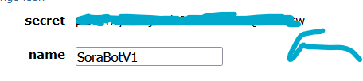

# sorabot-reddit 

# How to use:

1) Install the praw library by using the guide here: https://praw.readthedocs.io/en/stable/getting_started/installation.html

2) Go to this link (Reddit API app site for devs): https://www.reddit.com/prefs/apps and login with reddit account.
3) Once logged in, click "Are you a developer? create an app.."
4)  Name the app, select what type of app it is which in this case is a "Script"
5)  You can add optional description and for redirect url put "https://localhost"
6)  Then click create app.
7)  You will then find the client_id:

 secret_key:
   

and the developer (which in this case is your reddit username):

8) And for the user agent you can put "<console:TEXT" (replacing "TEXT" with your own string text)
9) Then once thats done, you can access the code and then change the necessary arguments then run it!
